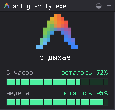
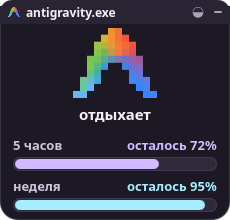
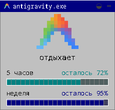
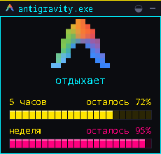

<div align="center">

# Antigravity Status (KDE Plasma 6)

<p align="center">
  <strong>Ретро пиксель-арт и Material 3 виджет мониторинга активности и квот Google Antigravity для KDE Plasma 6</strong>
</p>

[](https://kde.org/)
[](https://www.qt.io/)
[](LICENSE)
[](https://antigravity.google)
[](#-темы-оформления)

<br/>

<p align="center">
  
  &nbsp;&nbsp;&nbsp;
  
  &nbsp;&nbsp;&nbsp;
  
  &nbsp;&nbsp;&nbsp;
  
</p>

<sub><i>Retro Pixel · Material 3 Expressive · Windows 95 Classic · Cyberpunk 2077</i></sub>

</div>

---

## Особенности

- **100% реальные квоты из Antigravity CLI**: виджет обращается напрямую к официальной нативной команде `agy -p "/usage" --output-format json` и получает точные проценты для активных моделей (`gemini-5h` и `gemini-weekly`).
- **Мгновенный статус активности**: в реальном времени различает состояния агента:
  - `думает` — пока идет генерация токенов и стриминг ответа нейросетью.
  - `работает` — во время вызова тулов, команд и чтения файлов.
  - `отдыхает` — когда агент ожидает ввода от пользователя.
  - `спит` — когда процесс `agy` / `antigravity` не запущен.
- **7 тем оформления с переключением в 1 клик**:
  - `Retro Pixel (Classic)` — аутентичный стиль в духе *claude.exe* с неоновыми сегментами и рамочным ретро-окном.
  - `Material 3 Expressive` — современный закругленный стиль с выразительной палитрой (M3 Lilac & Cyan) и плавными pill-шкалами.
  - `Windows 95 Classic` — ностальгическая тема с синим заголовком, серым окном и бирюзовыми блоками.
  - `Cyberpunk 2077` — высококонтрастный терминал с неоновыми цветами `#ffe600` и `#ff007f`.
  - `Gruvbox Retro` — уютная теплая ретро-палитра.
  - `Catppuccin Mocha` — пастельный темный минимализм.
  - `Tokyo Night` — неоновый сине-фиолетовый стиль.
- **Интерактивный переключатель тем**: кнопка `◒` прямо в заголовке окна мгновенно переключает следующую тему, а также доступен выбор в настройках Plasma.
- **Точные проценты и таймер сброса**: при наведении или клике на шкалу отображается точный процент до десятых и обратный отсчет до сброса лимита (`осталось 71.9% (3ч 9м)`).
- **Плавный и адаптивный ресайз**: окно гармонично масштабируется на рабочем столе — маскот, шрифты, высота и толщина шкал увеличиваются пропорционально без пустых дыр.
- **0 задержек интерфейса**: квоты кэшируются на 30 секунд в фоне, а статус активности читается за 0.05 мс, гарантируя абсолютную плавность Plasma.
- **Два режима**: полноразмерное окно на рабочем столе и компактная иконка в системном лотке / панели задач.

---

## Темы оформления

| Тема | Описание | Стиль шкалы |
|---|---|---|
| **Retro Pixel** | Классический темный ретро-стиль окна с пиксельным шрифтом | Сегментированная неоновая шкала |
| **Material 3 Expressive** | Google M3 с закругленными углами и выразительными акцентами | Непрерывный скругленный Pill-бар |
| **Windows 95 Classic** | Аутентичный интерфейс Win95 с синей шапкой и скошенными рамками | Классические бирюзовые блоки |
| **Cyberpunk 2077** | Глубокий черный фон с кислотно-желтыми и розовыми индикаторами | Высококонтрастные светящиеся сегменты |
| **Gruvbox Retro** | Теплые тона для любителей классического Linux-терминала | Мягкие оливковые и аква сегменты |
| **Catppuccin Mocha** | Популярная пастельная тема (Mauve & Green) | Округлые аккуратные полосы |
| **Tokyo Night** | Глубокий индиго с неоновыми голубыми акцентами | Современные плавные индикаторы |

> Переключать темы можно нажатием на иконку `◒` в верхнем правом углу виджета либо в диалоге настроек (ПКМ → *Настроить виджет...*).

---

## Установка

### Быстрая установка через Git

```bash
git clone https://github.com/skippingclass/plasma-antigravity.git
cd plasma-antigravity
./install.sh
```

### Добавление на рабочий стол
1. Нажмите правой кнопкой мыши по рабочему столу или панели Plasma.
2. Выберите **«Добавить виджеты...»** (*Add Widgets*).
3. Найдите **Antigravity Status** и перетащите на экран.

### Перезапуск Plasma Shell (при обновлении)

Если виджет уже был открыт и вы хотите немедленно применить обновление:

```bash
systemctl --user restart plasma-plasmashell.service
```

---

## Настройки

Правый клик по виджету → **«Настроить виджет...»**:

| Вкладка | Параметр | Значение по умолчанию | Описание |
|---|---|---|---|
| **Внешний вид** | **Тема** | `Retro Pixel (Classic)` | Выбор одной из 7 доступных тем |
| **Внешний вид** | **Заголовок окна** | `antigravity.exe` | Текст в шапке ретро-окна |
| **Внешний вид** | **Цветовой акцент** | `Theme Default` | Принудительная замена акцента (зеленый / циан / янтарь) |
| **Внешний вид** | **Базовый масштаб** | `2x` | Масштаб пиксельной сетки |
| **Основные** | **Мониторинг CLI** | `Включен` | Автоматический опрос статуса и квот через `status_provider.py` |
| **Основные** | **Интервал опроса** | `1 сек` | Частота обновления активности процесса |
| **Основные** | **Пользовательский скрипт**| `(пусто)` | Путь к кастомному скрипту, возвращающему JSON |

---

## Как это работает

```
┌────────────────────────────────┐
│   KDE Plasma 6 (QML Shell)     │
│  [PixelWindow / FullRep]       │
└───────────────▲────────────────┘
                │ 1 раз/сек (0.05 мс)
┌───────────────┴────────────────┐
│      status_provider.py        │
├────────────────────────────────┤
│ 1. Проверка процесса:          │
│    pgrep -f (agy|antigravity)  │
│ 2. Активность (суб-секундно): │
│    mtime лога cli-*.log        │
│    'streamGenerateContent'     │
│    → «думает» / «работает»    │
│ 3. Квоты (кэш 30 сек в фоне): │
│    agy -p "/usage" --json     │
│    gemini-5h & gemini-weekly   │
└────────────────────────────────┘
```

1. **Почему виджет не тормозит систему?**  
   Запуск `agy -p /usage` делает сетевой запрос к серверам Google (~1-2 сек). Вызывать его напрямую каждую секунду из интерфейса заблокировало бы UI Plasma.  
   Провайдер сохраняет результат в `/tmp/agy_quota_cache.json`. Каждую секунду он лишь считывает этот крошечный JSON (за 0.05 миллисекунды) и параллельно в фоне обновляет кэш раз в 30 секунд.
2. **Как определяется «думает» vs «работает»?**  
   Во время размышлений модели и стриминга ответа `antigravity-cli` непрерывно дописывает данные в `~/.gemini/antigravity-cli/log/cli-*.log`. Если файл изменялся в последние 6 секунд и содержит дескриптор стриминга — агент «думает». Если вызывается утилита — «работает». Если запросов нет — «отдыхает».
3. **Почему ресайз выглядит аккуратно на любом мониторе?**  
   Геометрия построена на пропорциональных формулах (`dynamicMascotScale`, адаптивный шаг разделителей `spacingScale` и безопасные `minimumHeight`/`maximumHeight`). При растягивании окна пустые области не раздуваются в гигантские дыры, а маскот и шкалы увеличиваются вместе с окном.

---

## Если что-то не работает

- **Статус показывает «спит», хотя agy открыт:**  
  Убедитесь, что у процесса есть имя `agy` или `antigravity` (`pgrep -f "(agy|antigravity)"`).
- **Квоты показывают 100% / не обновляются:**  
  Проверьте, доступна ли команда `agy` в терминале:  
  ```bash
  agy -p "/usage" --output-format json
  ```  
  Если Antigravity CLI требует авторизации, выполните `agy` и пройдите вход в аккаунт.
- **Виджет не появляется в списке «Добавить виджеты»:**  
  Проверьте наличие установленного плагина:  
  ```bash
  ls ~/.local/share/plasma/plasmoids/org.kde.plasma.antigravity/
  ```  
  И перезапустите оболочку: `systemctl --user restart plasma-plasmashell.service`.
- **Запуск в отдельном окне для отладки:**  
  ```bash
  plasmawindowed org.kde.plasma.antigravity
  ```

---

## Для разработчиков

Тестирование виджета и скриптов в репозитории:

```bash
# Ручной запуск провайдера данных
contents/scripts/status_provider.py

# Тестовый рендер в отдельном окне
./test.sh

# Удаление плагина
./install.sh --uninstall
```

---

## Лицензия

MIT License © 2026 [skippingclass](https://github.com/skippingclass). Подробнее см. в файле [LICENSE](LICENSE).
